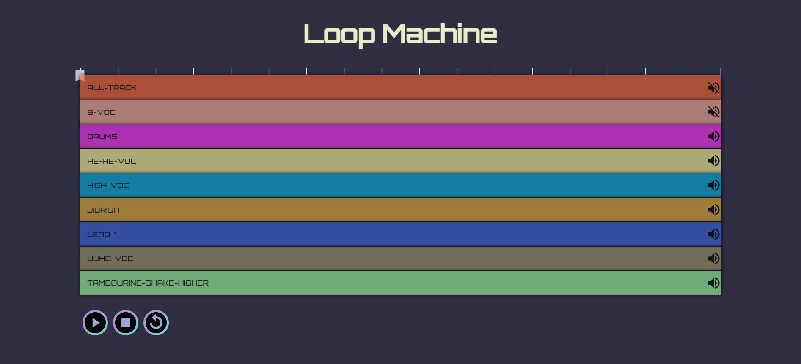

# Looping Machine

## Deployment Link

[Looping-Machine](link-goes-here)

## Description:

This is a loop Machine app which lets you play around with different audio tracks. 
Feature are written below :)

## Features:

- The page has 8 rows, each row is a channel which represents
  an audio loop.
- Each channel has a mute button (toggle on/off)
- Bottom sections has control buttons:

  - Play button - starts playing all channels simultaneously (which
    aren’t muted)
  - Stop button - Stops all playing channels and go back to start.
  - Loop button (toggle on/off) - when active, each time the loop ends
    immediately goes back to start and plays again (loop).

- Cursor on top of all channels shows your current playing position in real time (while playing).  
  Also has drag and drop abilities(moving the playback to the
  dropped position)

## Frameworks and libraries used:

- React.js
- MaterialUI
- InteractJS

## Screenshot:

